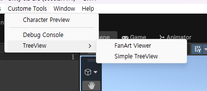
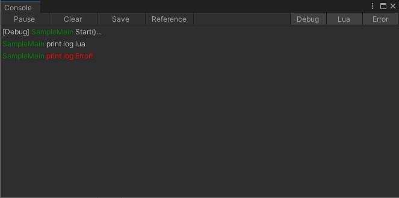
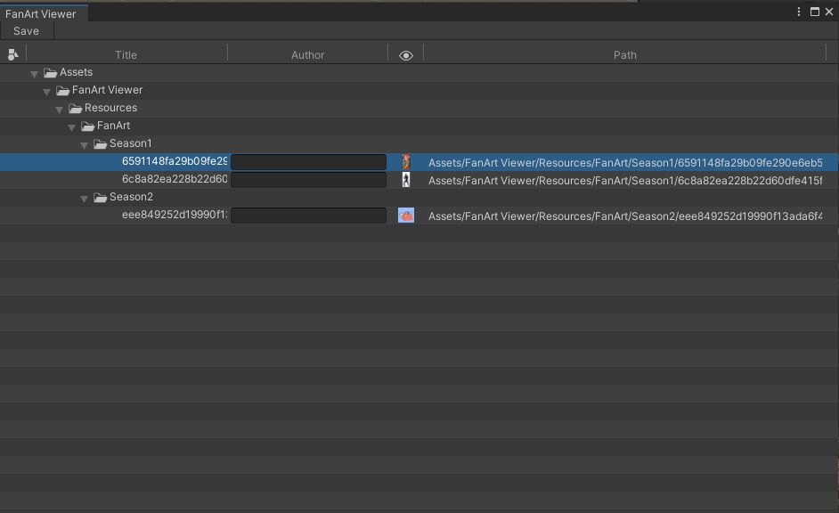
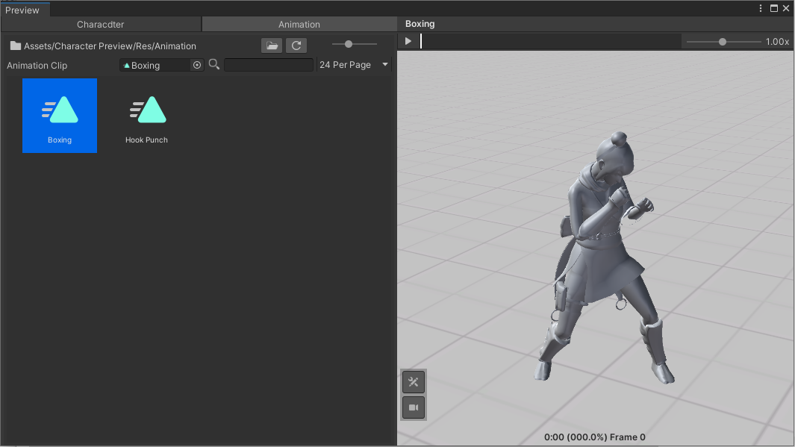

# Unity Custom Tools

유니티 에디터 상에서 제작한 에디터 확장 커스텀 툴 킷(Custom Tools)입니다.

---

## 📌 메뉴 구성

상단 메뉴바의 `Custom Tools` 항목을 통해 각 전용 툴 윈도우를 열 수 있습니다.



---

## 🛠 주요 기능

### 1. Debug Console (Log Viewer)

게임 실행 중 출력되는 로그를 커스텀 카테고리별로 실시간 필터링하여 출력하는 전용 콘솔 뷰어입니다.



* **주요 특징:** 
  * `Debug`, `Lua`, `Error` 상단 필터 버튼을 통한 실시간 로그 선택 출력
  * Clear, Save, Pause 등 디버깅 편의 기능 지원

  * **사용 예시 코드:**

```csharp
// 일반 디버그 로그
CustomTool.Debug.Log("<color=green>SampleMain</color> Start()...");

// Lua 연동 관련 로그
CustomTool.Debug.LogLua("<color=green>SampleMain</color> print log lua");

// 에러 로그
CustomTool.Debug.LogError("<color=green>SampleMain</color> print log Error!");
```

---

### 2. Tree File Viewer (TreeView)

`Assets/` 폴더 내에 등록된 파일 및 리소스를 드래그 앤 드롭(Drag & Drop)하여 트리 구조로 직관적으로 관리할 수 있는 뷰어입니다.



* **주요 특징:**
  * 계층 구조(Tree View) 형태로 에셋 경로, 타이틀, 작성자 등 메타 데이터 한눈에 파악
  * 드래그 앤 드롭 방식을 통한 간편한 파일 등록 및 원하는 프로젝트 파일 목록 수동 관리

---

### 3. Character Preview

Humanoid 타입 캐릭터에 선택한 애니메이션 클립을 즉시 적용하여 재생해 볼 수 있는 프리뷰 뷰어입니다.



* **주요 특징:**
  * 선택된 캐릭터(Humanoid)의 동작을 미리보기
  * 보유한 애니메이션 클립 목록 조회 및 타임라인 슬라이더를 통한 프레임별 동작 검증
  * 재생 속도 조절(Speed Slider) 및 프리뷰 카메라 뷰 컨트롤 기능 제공

---

## 📦 개발 환경 (Environment)
* **Unity Version:** Unity 3D 6.3
* **Language:** C#